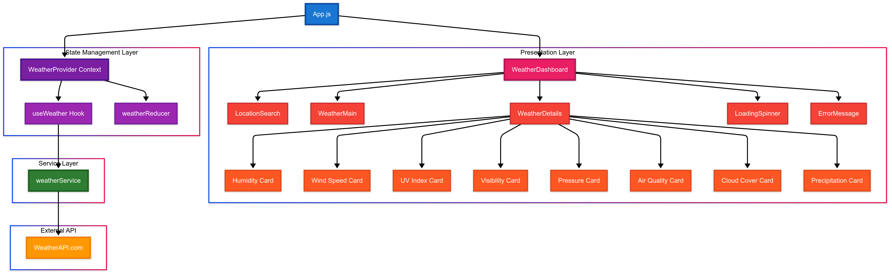

# Weather Reporter - React Application

A modern, responsive weather application built with React that displays real-time weather conditions for any city worldwide.

## 🏗️ Application Architecture



The application follows a clean, layered architecture with four distinct layers:

- **🔵 App Layer**: Main application entry point and routing
- **🟣 State Management**: React Context API with useReducer for centralized state
- **🔴 Presentation Layer**: UI components including weather cards and search functionality  
- **🟢 Service Layer**: API abstraction for external weather data
- **🟠 External API**: WeatherAPI.com integration for real-time weather data

## ✨ Key Features

- **Real-time Weather Data**: Current conditions, temperature, humidity, wind speed, UV index
- **Location Search**: Autocomplete search for cities worldwide
- **Responsive Design**: Optimized for mobile, tablet, and desktop
- **Auto-refresh**: Updates every 10 minutes automatically
- **Error Handling**: Graceful fallbacks and retry mechanisms
- **Modern UI**: Clean design with 60-30-10 color theory implementation

## 🚀 Quick Start

```bash
# Install dependencies
npm install

# Add your WeatherAPI key to .env
REACT_APP_WEATHER_API_KEY=your_api_key_here

# Start development server
npm start
```

## 🎯 Tech Stack

- **Frontend**: React 18 with Hooks
- **State Management**: Context API + useReducer
- **Styling**: Pure CSS with responsive design
- **API**: WeatherAPI.com
- **Deployment**: Vercel